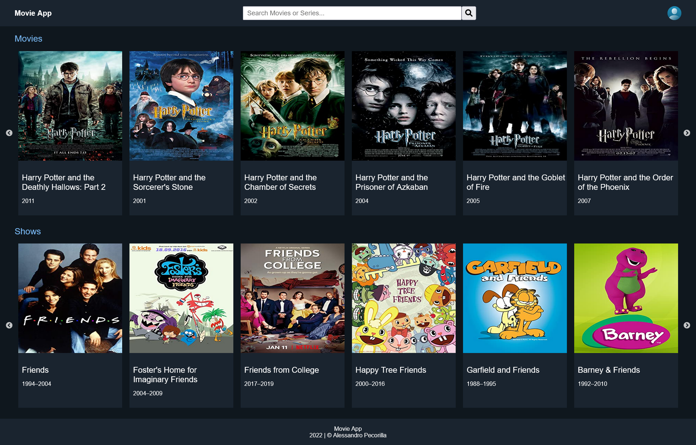
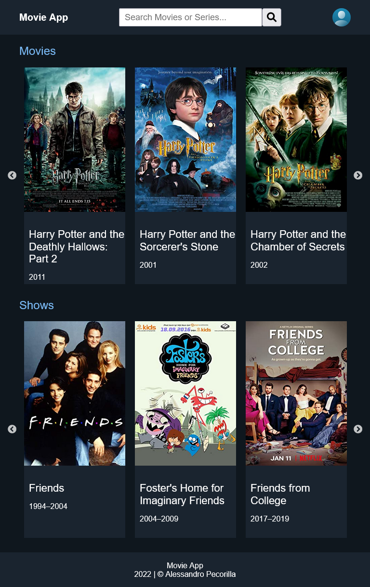
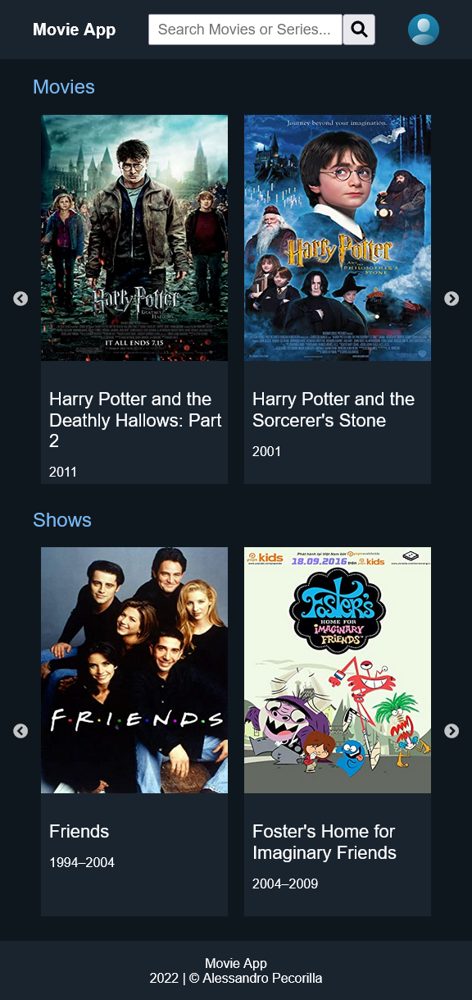
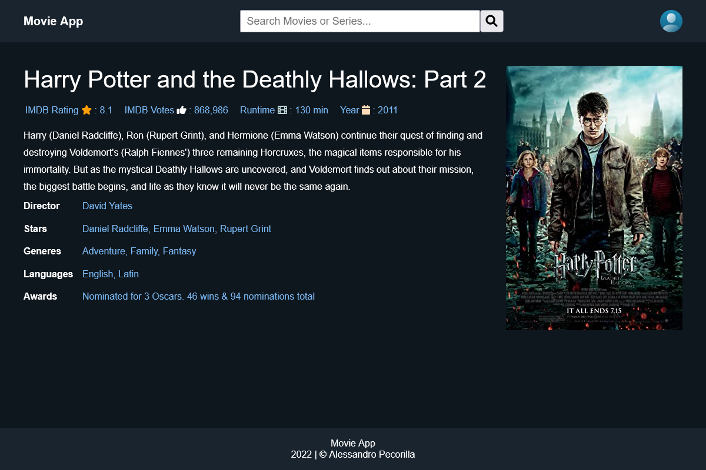
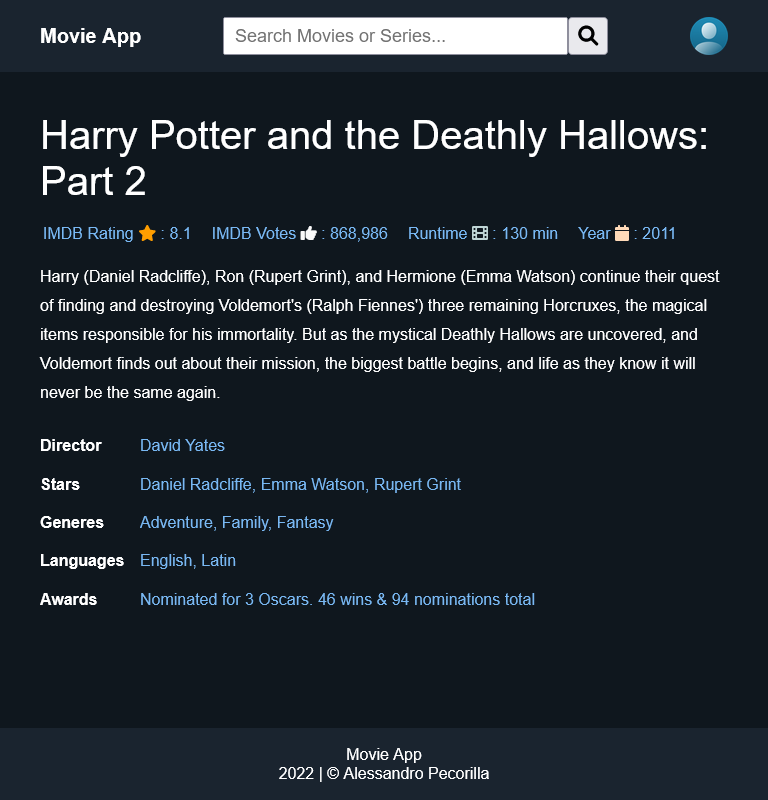
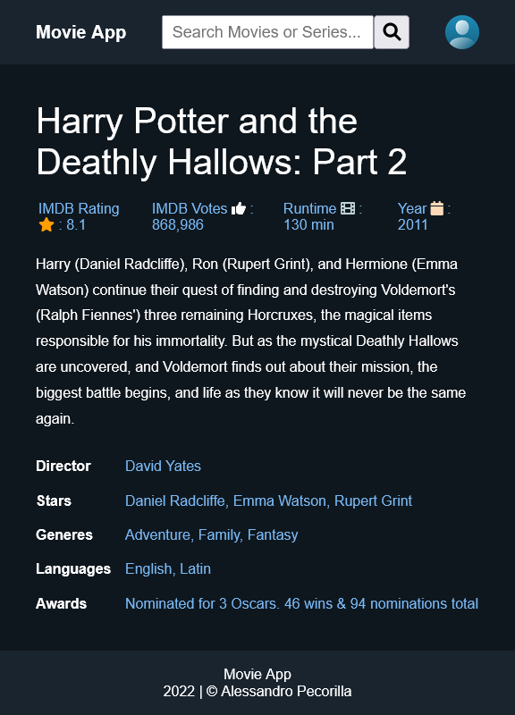

# React Redux Movies

This project was created for understand Redux toolkit and Axios library. 
It's an easy project that allows users to find a movie and its spec (like rating, stars, actors etc.)  

`DESKTOP` version



`TABLET` version



`SMARTPHONE` version



## Documentation

This is how I've divided my `src` folder :

INSERISCI IMMAGINE `FOLDER`

`common` : It's the folder where I've created all the common utilities for my project, 
like the `API's` folder and the `color.scss`

`components` : It's the folder where all my components are based.

`features` : It's the folder where my `redux slice` is based.

## Movie Details

Every movie was `wrapped` inside a `routing component` that allows user to see the details of every movie

`DESKTOP` Details 



`TABLET` Details



`SMARTPHONE` Details




## API Reference

#### Website

I have tooken the **API** from **OMDB**


| Const     | Type     |  Description               |
| :-------- | :------- | :------------------------- |
| `movieApiKey` | `string` | **Required**. Your API key |

#### Functions

Takes the `movies` from **OMDB**

```js
const fetchAsyncMovies = createAsyncThunk('movies/fetchAsyncMovies', async (term) => {
    // Take the response from axios
    // &s=${movieText} => Movie title to search for
    // &type=movie` => Type of result to return (It can be a movie, serie etc)
    const response = await movieApi.get(`?apiKey=${APIKey}&s=${term}&type=movie`)
    return response.data
})
```

Takes the `shows` from **OMDB**

```js
const fetchAsyncShows = createAsyncThunk('movies/fetchAsyncShows', async (term) => {
    // Take the response from axios
    // &s=${seriesText} => Serie title to search for
    // &type=series` => Type of result to return (It can be a movie, serie etc)
    const response = await movieApi.get(`?apiKey=${APIKey}&s=${term}&type=series`)
    return response.data
})
```

Takes the details of a `shows` or a `movies` from **OMDB**

```js
const fetchAsyncMovieOrShowDetail = createAsyncThunk('movies/fetchAsyncMovieOrShowDetail', async (id) => {
    // Take the response from axios
    // &i=${id}$Plot=full => Return the plot of the serie/movie, filtered by id
    const response = await movieApi.get(`?apiKey=${APIKey}&i=${id}&Plot=full`)
    return response.data
})
```